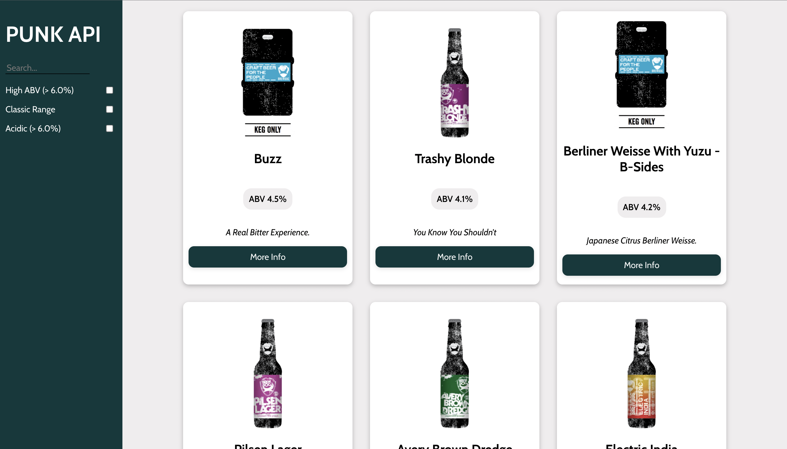

# Punk API 
## Author - Abdul Oketunde

## Overview 
This project was created in week 6 of the _nology course. The project aimed to test our knowledge on REACT and API's. Our tasks was to render the data from the Punk API onto the page, and also select our choice of beers by using filter and search functionality.

[Check out the Live Demo!](https://ab-96.github.io/punk-api/)

# Future Implementations 
To Enable extra filter functionality. 